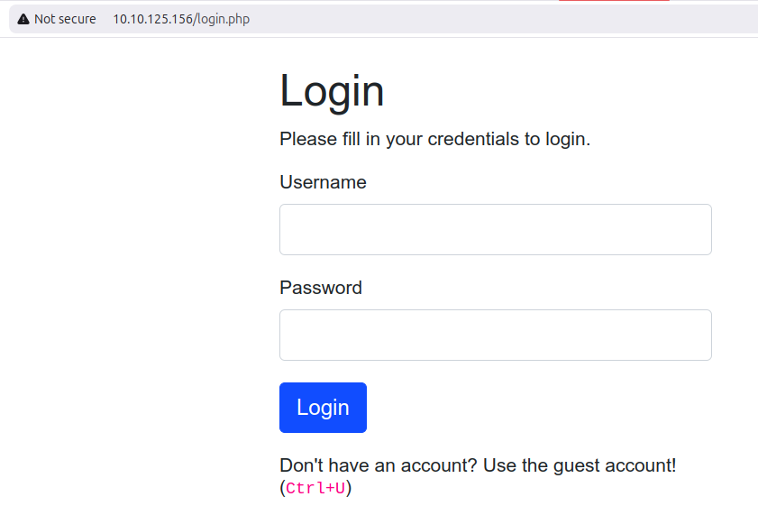
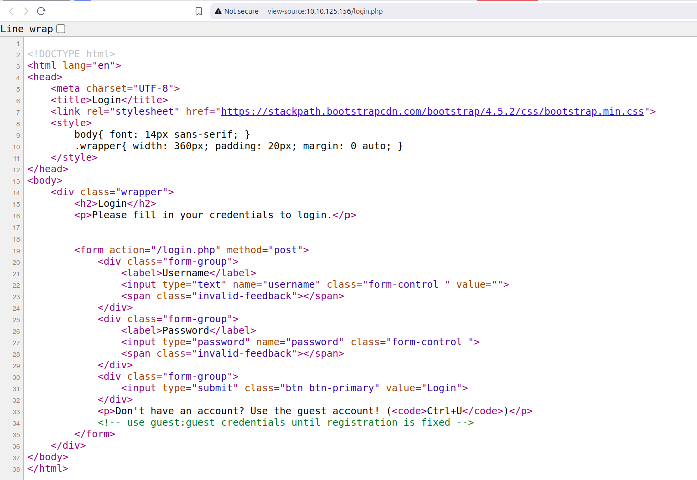
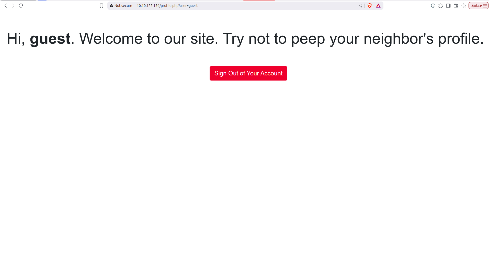
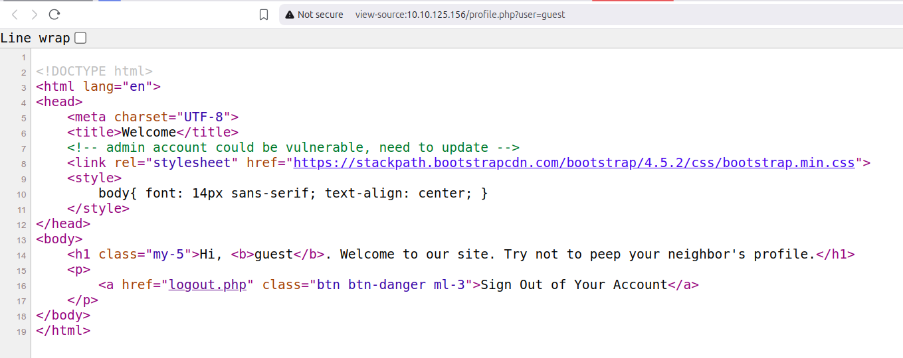
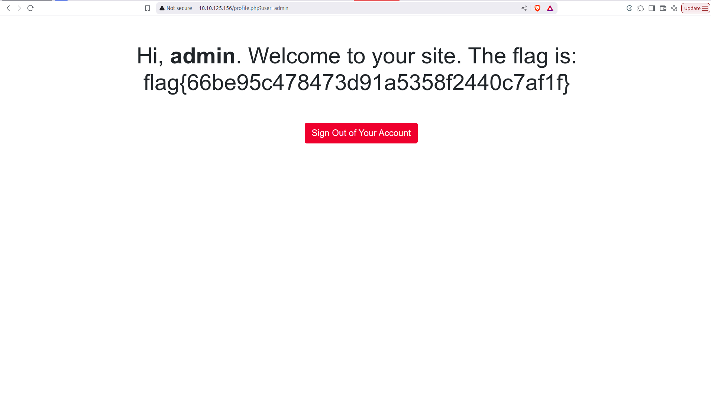

This is the [TryHackMe Neighbour challenge](https://tryhackme.com/room/compiled).

\
Q: What's an IDOR?
A: Insecure direct object references (IDOR) is a type of access control vulnerability where an attacker can gain unauthorized access to resources by manipulating user input, usually in URLs, form data, or APIs.

How it works:
A web app might use an identifier like a user ID or file name to access something, but fail to check whether the user is authorized to access it.
If the site doesn't check your permission, and shows you another user's profile, that's an IDOR vulnerability.

\
We connect to the server.

And we see this as the login page:


As we don't have an account, we use the guest account!'\
To do this, we press `ctrl+U`

Then we see

in which there is
```html
            <!-- use guest:guest credentials until registration is fixed -->
```

So we log in as the guest:
Username: `guest`
Password: `guest`

And press the "Login" button.


Now, we are in the profile page of the guest:



We have the URL ```http://10.10.125.156/profile.php?user=guest```

And `guest` is the user ID of the guest.

And when we press `ctrl+U` again on the guest's profile page, we see the html code:\

We see:
```html
    <!-- admin account could be vulnerable, need to update -->
```
so from this commented line, we know the user ID of the administrator is `admin`.

Thus, by definition of IDOR, we change the URL from the user ID of `guest` to `admin`, i.e.:
```http://10.10.125.156/profile.php?user=admin```

<!--  -->
And there's the flag!